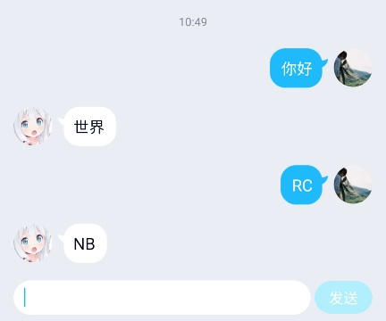
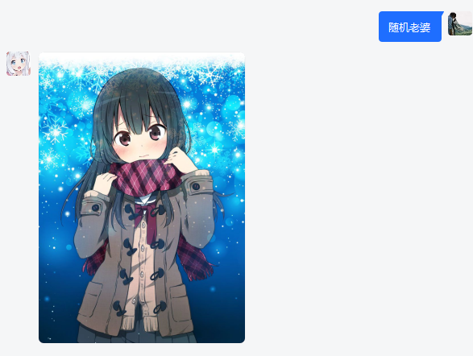
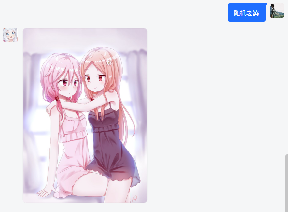
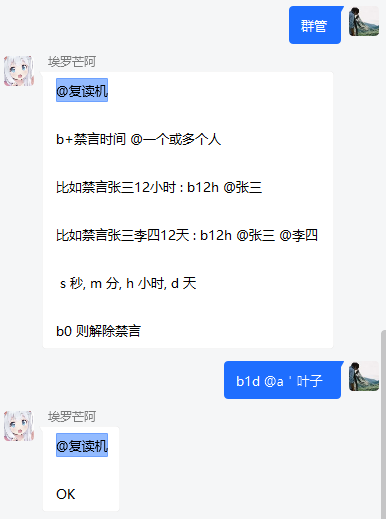

RUST_PROC_QQ
============

[](https://raw.githubusercontent.com/niuhuan/rust_proc_qq/master/LICENSE)
[](https://crates.io/crates/proc_qq)

- Rust语言的QQ机器人框架. (基于[RICQ](https://github.com/lz1998/ricq))
- 开箱即用, 操作简单, 代码简洁

QQ机器人框架 | [Telegram(电报)机器人框架](https://github.com/niuhuan/teleser-rs)

## 框架目的

- 简单化 : 让程序员写更少的代码
    - 自动管理客户端生命周期以及TCP重连
    - 封装登录流程, 自动获取ticket, 验证滑动条
- 模块化 : 让调理更清晰
    - 模块化, 实现插件之间的分离, 更好的启用禁用

# 设计思路

所有的功能都是由插件完成, 事件发生时, 调度器对插件轮训调用, 插件响应是否处理该事件, 直至有插件响应事件, 插件发生异常,
或插件轮训结束, 最后日志结果被记录, 事件响应周期结束。


## 如何使用 / demo

如果您使用密码登录，并且不是windows系统，则需要使用安卓设备安装滑块助手，用于第一次登录的验证(windows将会默认使用弹窗进行滑块，除非您禁用它)

https://github.com/mzdluo123/TxCaptchaHelper


### 新建项目

新建一个rust项目, 并将rust环境设置为nightly

```shell
# 设置rust默认环境为 nightly
rustup default nightly

# 或

# 设置当前项目rust环境设置为 nightly
rustup override set nightly
```

### 引用

在Cargo.toml中引入proc_qq

```toml
proc_qq = "0.1"
```

如果您使用的较新nightly的rust时，ricq可能会编译不通过，您需要使用git的方式引入。在ricq发布到到0.1.20时我们将去除这个提示.

同样master分支具有一些新的features，以及使用了较高版本ricqAPI，还没有发布到 crates.io。

```toml
proc_qq = { git = "https://github.com/niuhuan/rust_proc_qq.git", branch = "master" }
```


### 声明一个模块

hello_module.rs

```rust
use proc_qq::re_exports::ricq::client::event::GroupMessageEvent;
use proc_qq::{
    event, module, MessageChainParseTrait, MessageContentTrait, MessageEvent, MessageSendToSourceTrait,
    Module,
};

/// 监听群消息
/// 使用event宏进行声明监听消息
/// 参数为RICQ支持的任何一个类型的消息事件, 必须是引用.
/// 返回值为 anyhow::Result<bool>, Ok(true)为拦截事件, 不再向下一个监听器传递
#[event]
async fn print(event: &MessageEvent) -> anyhow::Result<bool> {
    let content = event.message_content();
    if content.eq("你好") {
        event
            .send_message_to_source("世界".parse_message_chain())
            .await?;
        Ok(true)
    } else if content.eq("RC") {
        event
            .send_message_to_source("NB".parse_message_chain())
            .await?;
        Ok(true)
    } else {
        Ok(false)
    }
}

#[event]
async fn group_hello(_: &GroupMessageEvent) -> anyhow::Result<bool> {
    Ok(false)
}

/// 返回一个模块
pub(crate) fn module() -> Module {
    // id, name, [plugins ...]
    module!("hello", "你好", print, group_hello)
}
```

### 启动

main.rs

```rust
use tracing::Level;
use tracing_subscriber::{layer::SubscriberExt, util::SubscriberInitExt};

use proc_qq::Authentication::{QRCode, UinPassword};
use proc_qq::ClientBuilder;

mod hello_module;

/// 启动并使用为二维码登录
#[tokio::test]
async fn test_qr_login() {
    // 初始化日志打印
    init_tracing_subscriber();
    // 使用builder创建
    let client = ClientBuilder::new()
        // 使用session.token登录
        //    .session_store(Box::new(FileSessionStore {
        //      path: "session.token".to_string(),
        //    }))
        .authentication(QRCode)                    // 若不成功则使用二维码登录
        // 注意，这里使用的设备必须支持二维码登录，例如安卓手表
        // 如果您使用为不支持的协议协议，则会登录失败，例如安卓QQ 
        // .authentication(UinPasswordMd5(config.account.uin, password)) // 账号密码登录
        .device(JsonFile("device.json")) // 设备默认值 
        .version(&ANDROID_WATCH)  // 安卓手表支持扫码登录
        // .show_slider_pop_menu_if_possible() // 密码登录时, 如果是windows, 弹出一个窗口代替手机滑块 (需要启用feature=pop_window_slider)
        .modules(vec![hello_module::module()])    // 您可以注册多个模块
        .show_rq(Some(ShowQR::OpenBySystem))  // 自动打开二维码 在macos/linux/windows中, 不支持安卓
        .build()
        .await
        .unwrap();
    run_client(client.into()).await?;
}

fn init_tracing_subscriber() {
    tracing_subscriber::registry()
        .with(
            tracing_subscriber::fmt::layer()
                .with_target(true)
                .without_time(),
        )
        .with(
            tracing_subscriber::filter::Targets::new()
                .with_target("ricq", Level::DEBUG)
                .with_target("proc_qq", Level::DEBUG)
                // 这里改成自己的crate名称
                .with_target("proc_qq_examples", Level::DEBUG),
        )
        .init();
}

```

### 效果



## 功能

### 登录

- 打印二维码到控制台 `.show_rq(Some(ShowQR::PrintToConsole))`
- [自定义显示二维码](docs/CustomShowQR.md)

### 支持的事件

```rust
use ricq::client::event::{
    DeleteFriendEvent, FriendMessageEvent, FriendMessageRecallEvent, FriendPokeEvent,
    NewFriendRequestEvent, GroupLeaveEvent, GroupMessageEvent, GroupMessageRecallEvent,
    GroupMuteEvent, GroupNameUpdateEvent, JoinGroupRequestEvent, KickedOfflineEvent, MSFOfflineEvent,
    NewFriendEvent, GroupTempMessageEvent,
};
use ricq::client::event::{
    GroupDisbandEvent, MemberPermissionChangeEvent, NewMemberEvent, SelfInvitedEvent,
    GroupAudioMessageEvent, FriendAudioMessageEvent, ClientDisconnect,
};
use proc_qq::{
    MessageEvent, LoginEvent, ConnectedAndOnlineEvent, DisconnectedAndOfflineEvent,
};
```

- MessageEvent: 同时适配多种消息
- LoginEvent: 登录事件(未登录成功) (RICQ中这个事件类型为i64,这里做了封装)
- ConnectedAndOnlineEvent: 连接成功, 并且登录后 (proc-qq状态)
- DisconnectedAndOfflineEvent: 掉线并且断开连接 (proc-qq状态)

支持更多种事件封装中...

## 字段匹配

对消息进行匹配（`空白字符`或`RQElem界限`作为分隔符）

如下所示，当您输入 `ban @abc 123` 的时候，控制台将会打印 `user : [At:abc] , time : 123`

```rust
#[event(bot_command = "ban {user} {time}")]
async fn handle5(
  _message: &MessageEvent,
  user: ::proc_qq::re_exports::ricq::msg::elem::At,
  time: i64,
) -> anyhow::Result<bool> {
    println!("user : {:?} , time : {:?} ", user, time);
    Ok(true)
}
```

同样的也支持文字和数字的组合

```rust
#[event(bot_command = "请{time}秒之后告诉我{text}")]
async fn handle5(
  _message: &MessageEvent,
  time: i64,
  text: String,
) -> anyhow::Result<bool> {
  println!("text : {:?} , time : {:?} ", text, time);
  Ok(true)
}
```

TODO:枚举 : "请{time}{unit:时|分|秒|天}之后告诉我{text}"

#### 目前能匹配的类型
```
String,  以及对应的 Vec<T>， Option<T>

u8~u128, i8~i128, isize, usize, char, bool, f32, f64; 以及对应的 Vec<T>， Option<T>

ricq::msg::elem::{
  At, Face, MarketFace, Dice, FingerGuessing,
  LightApp, RichMsg, FriendImage, GroupImage,
  FlashImage, VideoFile
}; 以及对应的 Vec<T>， Option<T>

proc_qq::ImageElement (匹配图片, 包括GroupImage, FriendImage, FlashImage)
; 以及对应的 Vec<T>, Option<T> 

Vec<T> 会匹配多个，也会匹配0个, 会尽可能多的匹配。
Option<T> 匹配到一个会返回Some，否则返回None。
空白字符串以及空字符串，不会被匹配为值
```

### 自定义类型匹配
- 您可以参考`proc_qq/src/handler/mod.rs`中`FromCommandMatcher`实现自定义类型的匹配。
- 您可以匹配文字，并且在`FromCommandMatcher::matching`去掉消耗了的部分
- 如果匹配的是RQElem类型，您应该先判断`matching`是否为空，不空则不能匹配成功，如果匹配的元素，然后将`idx`加1, 最后push_text
- 这里比较难解释，需要您阅读`FromCommandMatcher`的代码，理解他的工作原理

### 拓展

#### 直接获取消息的正文内容

```rust
use prco_qq::MessageContentTrait;
MessageEvent::message_content;
```

#### 直接回复消息到消息源

```rust
Client::send_message_to_source;
Event::send_message_to_source;
Event::send_audio_to_source;
```

#### 直接将单个消息文字/图片当作MessageChain使用

```rust
MessageChainParseTrait;

client
.send_group_message(group_code, "".parse_message_chain())
.await?;
```

####     

MessageChain链式追加

```rust
MessageChainAppendTrait;

let chain: MessageChain;
let chain = chain.append(at).append(text).append(image);
```

## 事件结果

使用result_handlers监听处理结果 (事件参数正在开发)

用来监听message或者其他event的处理结果（有无异常，由哪个模块处理，主要用于日志记录）

[Example](docs/EventResult.md)

## 定时任务或客户端事件发送消息

参考template, 使用run_client(Arc\<Client\>), 使得机器人与定时任务并行, 并使用rc_client发送消息

### 其他
`ricq::msg::elem::Other`在push_text的时候将会跳过

## 过滤器

    event参数
    MessageEvent / FriendMessageEvent / GroupMessageEvent / GroupTempMessageEvent
    trim_regexp trim_eq regexp eq all any not
    为什么会有trim: ricq获取消息会在最后追加空白字符

```rust
#[event(trim_regexp = "^a([\\S\\s]+)?$", trim_regexp = "^([\\S\\s]+)?b$")]
async fn handle2(event: &MessageEvent) -> anyhow::Result<bool> {
    event
        .send_message_to_source("a开头且b结束".parse_message_chain())
        .await?;
    Ok(true)
}

#[event(any(trim_regexp = "^a([\\S\\s]+)?$", trim_regexp = "^([\\S\\s]+)?b$"))]
async fn handle3(event: &MessageEvent) -> anyhow::Result<bool> {
    event
        .send_message_to_source("a开头或b结束".parse_message_chain())
        .await?;
    Ok(true)
}
```

## 手动实现handler和原理

手动实现一个handler

```rust

/// 每个handler都是一个struct
struct OnMessage;

/// 给他实现一个Process, 它就对应着监听什么事件
#[async_trait]
impl MessageEventProcess for OnMessage {
    async fn handle(&self, event: &MessageEvent) -> anyhow::Result<bool> {
        self.do_some(event).await?;
        Ok(true)
    }
}

/// 实现一些其他的方法用于调用
impl OnMessage {
    async fn do_some(&self, _event: &MessageEvent) -> anyhow::Result<()> {
        Ok(())
    }
}

/// 将process转换成handler
fn on_message() -> ModuleEventHandler {
    ModuleEventHandler {
        name: "OnMessage".to_owned(),
        process: ModuleEventProcess::Message(Box::new(OnMessage {})),
    }
}

/// 将转化的方法名写到里面
pub(crate) fn module() -> Module {
    module!("hello", "你好", login, print, group_hello, on_message)
}
```

为什么要强调一下手动创造handler

```rust

async fn do_some(_event: &MessageEvent) -> anyhow::Result<()> {
    // 做一些线程不安全的事情
    Ok(())
}

#[event]
async fn handle(event: &MessageEvent) -> anyhow::Result<bool> {
    do_some(event).await?;  // 那么这里的引用生命周期有问题
    Ok(true)
}

```

总会遇到一些线程不安全的类, 例如*scraper*. 这个时候编译器会反复告诉你 "maybe used later". 您可以尝试使用手创造一个handler解决.

### 使用event_fn解决生命周期问题

```rust
#[event]
async fn handle4(message: &MessageEvent) -> anyhow::Result<bool> {
    self.handle3_add(message).await;
    Ok(false)
}

#[event_fn(handle3, handle4)]
async fn handle3_add(message: &MessageEvent) {
    println!("{}", message.message_content());
}
```

## 网络代理

[Example](docs/Proxy.md)

代理功能有助于您使用服务器的ip登录proc_qq, 并有助于部署到非大陆服务器

- 您可以在安卓设备上设置代理（按APP进行分流）并启动手机QQ登录。
- 在proc_qq设置代理并扫码登录安卓手表（届时proc_qq和手机QQ都处于服务器IP）。
- 删除session.token, 使用账号密码登录。
- 登录成功后将session.token和device.json都复制到服务器并启动，本地的文件备份好并且不再使用。

## 其他

实现的功能请转到RICQ仓库查看, 本仓库仅为RICQ的框架.

RICQ 还在发展阶段, 迭代速度较快, 可能出现更改API的情况, 如遇无法运行, 请提issues.

#### [Examples](proc_qq_examples) 中提供了HelloWorld

#### [Template](proc_qq_template) 是一个机器人模版, 并提供了一些模块

##### 模版中封装了一些常用功能

直接回复文字, 如果是在群中会自动@

```rust
event.reply_text("你好").await?;
```







##### 数据库的说明

模版中使用了redis作为缓存, mongo作为数据库. 两个数据源搭建都非常简单.

- redis: 先下载[源码](https://redis.io/download), make, 运行 ./redis-server
- mongo: 下载[安装包](https://www.mongodb.com/try/download/community), 运行 ./mongod

如不需要, 请将database删除, 删除引用它的module, 最后删除main.rs中的init_mongo和init_redis.

##### 额外依赖的说明

模版中演示了如何发送语音消息

每日英语模块需要运行环境已经安装ffmpeg命令, 并且依赖silk-rs, 编译silk-rs需要libclang.dll.

- 下载LLVM-${version}-win64.exe并安装 : https://github.com/llvm/llvm-project/releases/
- 下载ffmpeg : https://www.ffmpeg.org/download.html

##### 额外协议的说明

- 暂定本仓库开源协议与RICQ保持一致.
    - MPL 2.0
    - 如RICQ更换协议, 请以最新协议为准, 您可以提出ISSUE提醒我进行更新
- 仓库持有人在变更仓库协议时无需经过其他代码贡献者的同意, 您在PR时就代表您同意此观点

#### 鸣谢

- RICQ commiters


- JetBrains IDEs


- GitHub Copilot


